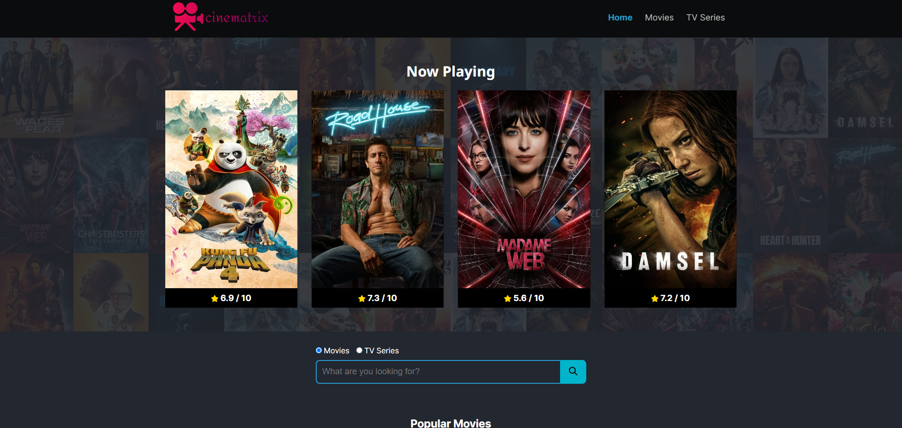
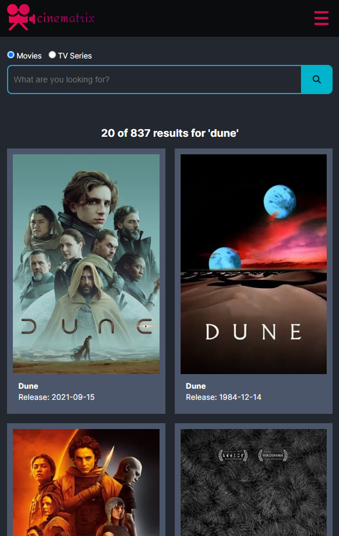

Cinematrix is a web application built with HTML, CSS, and JavaScript that allows users to explore currently playing movies, popular movies, and TV series. It utilizes the TMDB API to fetch movie and TV series data, and incorporates the JS Swiper library for smooth carousel effects.

## Features

- Currently Playing Movies: Displays a list of movies currently playing in theaters.

- Popular Movies: Showcases a collection of popular movies.

<p align="center">
    
</p>

- Search Functionality: Users can search for specific movies or TV series by typing in keywords.

<p align="center">
    
</p>

- Pagination: Search results are paginated, allowing users to navigate between multiple pages of results.

<p align="center">
    
</p>

- Upcoming Movies and Popular TV Series: Users can easily access upcoming movies or popular TV series by clicking on the respective headers.

- Detailed Content Pages: Each movie or TV series has its own detailed page with information such as overview, official page link, IMDb link, budget, revenue, release date, languages, and production companies.

<p align="center">
    
</p>

## Dependencies

[TMDb API](https://www.themoviedb.org/): Cinematrix fetches movie and TV series data from the TMDb API.

[JS Swiper Library](https://swiperjs.com/): Swiper is used to create smooth carousel effects for displaying movie and TV series posters.

## Usage

Clone the repository to your local machine.

```bash
git clone https://github.com/halil-yesilyurt/cinematrix
```

Obtain an API key from TMDb and replace 'YOUR_API_KEY' in `/script/app.js` with your actual API key.

```javascript
global.api.apiKey = 'YOUR_API_KEY';
```

Open `index.html` in your preferred web browser.

Explore currently playing movies, popular movies, and TV series. Use the search functionality to find specific movies or TV series.

## Contributing

Contributions are welcome! If you'd like to contribute to Cinematrix, feel free to fork this repository and submit a pull request with your changes.
